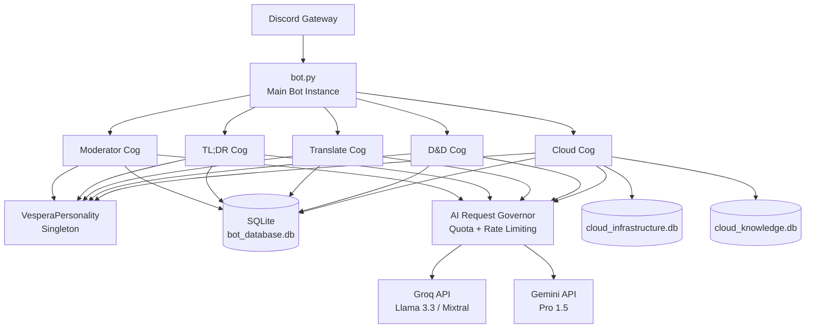

# Current Architecture

> **Status:** Phase 1 — Complete & Live

Vespera's current architecture is a **monolithic multi-cog design** — intentionally built this way for Phase 1 to maximize reliability and minimize complexity while fitting within aggressive resource constraints (1 vCPU / 1GB RAM).

!!! note
    This is a monolith. There is no multi-agent coordination yet. Every command is a direct Discord interaction → cog → AI call → response. The planned Lite MAS architecture (Phase 2) will change this. See [Planned: Lite MAS](lite-mas.md).

---

## High-Level Component Diagram



---

## Resource Optimization for 1-Core / 1GB RAM

Building for a low-spec VPS required deliberate engineering decisions at every layer:

### 1. SQLite WAL Mode
All databases are opened in **Write-Ahead Logging (WAL) mode** on startup. This allows concurrent readers without blocking writers, eliminating "database is locked" errors when multiple cogs read/write simultaneously via asyncio.

```python
conn.execute("PRAGMA journal_mode=WAL;")
```

### 2. asyncio Concurrency (Single Thread)
The entire bot runs on a **single asyncio event loop**. All I/O operations (Discord API, Groq API, SQLite reads) are non-blocking `await` calls. This means the 1 CPU core is never sitting idle waiting for network responses — it processes other events while waiting.

### 3. Streaming Markdown Parser
For large file inputs (TL;DR, Cloud log analysis), content is parsed in **stream-safe chunks** rather than loaded fully into RAM. This prevents any single operation from spiking memory usage.

### 4. Ephemeral Sessions
Cloud deployment sessions are created in-memory only for their active duration. When a session expires or the user disconnects, the `session_cleanup_service.py` background worker evicts all associated objects, preventing session data from accumulating over time.

### 5. Aggressive GC Tuning
Python's default garbage collection thresholds are overridden to force more frequent collection:

```python
import gc
gc.set_threshold(100, 5, 5)  # More aggressive than default (700, 10, 10)
```

### 6. String Interning for Repeated Strings
In modules that process large text (TL;DR, Translator), repeated strings like usernames or common headers are interned:

```python
import sys
username = sys.intern(username)  # One object in memory, no matter how many references
```

### 7. LRU Caches with Hard Caps
All AI result caches use `functools.lru_cache` or custom LRU implementations with a hard item limit (max 128 entries). Caches never grow unbounded regardless of runtime duration.

---

## AI Request Governor

A central request governor (`ai_request_governor.py`) sits between all cogs and the external AI APIs:

- **Quota management**: Per-user daily usage limits
- **Rate limiting**: Prevents API burst that would trigger provider throttling
- **Model fallback**: If Groq is unavailable, transparently falls back to Gemini and vice versa
- **Concurrency semaphore**: Max 3 simultaneous AI requests to prevent RAM spikes from concurrent large prompts

---

## Database Schema Overview

| Database | Purpose |
|----------|---------|
| `bot_database.db` | User profiles, D&D characters, session state, moderation logs |
| `cloud_infrastructure.db` | Cloud deployment sessions, Terraform state, provisioning records |
| `cloud_knowledge.db` | RAG knowledge base — 186 cloud best practices |

All three use WAL mode and are accessed exclusively through typed function wrappers in `database.py` and `cloud_database.py` — no raw SQL scattered through cog code.
