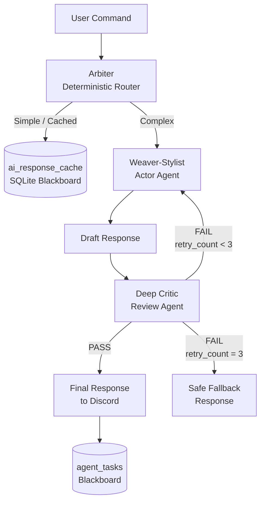
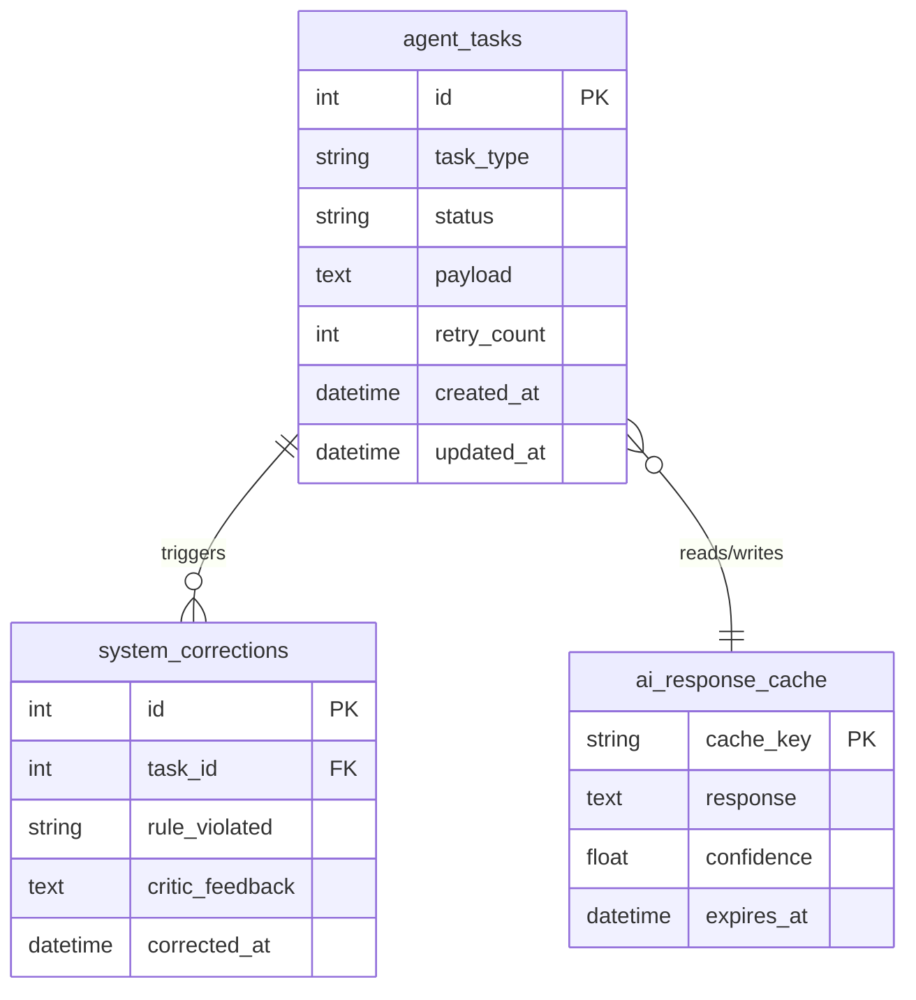

# Planned — Lite MAS (Multi-Agent System)

!!! warning "Not Yet Implemented"
    This page documents the **planned Phase 2 architecture** targeting **June 2026**. Nothing described here is currently deployed. The goal is to evolve Vespera from a monolithic utility into a coordinated Multi-Agent System (MAS) optimized for low-resource environments.

---

## The Problem with Phase 1

The monolithic architecture works, but it has a core reliability weakness: **the AI is trusted to self-regulate**. When generating a Terraform configuration or a D&D combat result, there is only one model call. If that model is wrong — hallucinated resource type, broken rule reference — the bad output goes directly to the user.

Phase 2 corrects this with **Separation of Concerns at the agent level**.

---

## The Hybrid Action Pipeline



### The Three Agents

| Agent | Role | Mechanism |
|-------|------|-----------|
| **Arbiter** | Deterministic router. Decides if a request can be answered from cache or needs generation. Never calls an LLM directly. | Rule-based Python, zero latency |
| **Weaver-Stylist** | Actor. Generates the draft response in Vespera's persona. Combined into one agent to avoid the overhead of a separate styling pass on a 1GB system. | Groq or Gemini depending on task |
| **Deep Critic** | Reviewer. Checks the draft against the Truth Block (5e rules or Terraform spec). Sends it back for retry if rules are violated. | Separate LLM call with structured validation prompt |

---

## The Blackboard — SQLite State Machine

The Blackboard is a set of SQLite tables that act as shared memory between agents. This allows agents to **hibernate when idle**, eliminating the memory cost of keeping them in active RAM.



### Cache Poisoning Mitigation
All cache entries include a `confidence` score. Entries below a threshold are not served from cache and are re-generated. Cache writes from the Critic's rejected drafts are blocked entirely.

---

## Explainable AI — The `/why` Command

The XAI (Explainable AI) system adds a `logic_trace` to every `agent_tasks` row. When a user runs `/why`, Vespera reads the trace and explains:

- Which agent processed the request (Arbiter vs Weaver vs Critic)
- Which rule or resource spec the Critic validated against
- How many retries occurred before the final answer was accepted

This turns Vespera's decision-making from a black box into an auditable log.

---

## Security Mitigations

| Threat | Mitigation |
|--------|-----------|
| **Cache Poisoning** | Confidence threshold gate; Critic-rejected drafts cannot write to cache |
| **Loop Injection** | Hard `retry_count` cap (max 3); 3 failures → safe fallback response |
| **Prompt Jailbreaks** | Critic validates structural correctness of output, not just content; malformed JSON outputs are rejected regardless of content |
| **Resource Exhaustion** | Asyncio semaphore (max 3 concurrent agent pipelines); additional requests queue with a max depth of 10, then drop |

---

## Queue Dropout Math

With a semaphore of 3 concurrent pipelines and a queue depth of 10:

```
Concurrent slots:  3
Queue depth:       10
─────────────────────
Max in-flight:     13 tasks handled gracefully
Task 14+:          dropped with a "Server busy" ephemeral response

Observed in load testing:
  100 simultaneous requests → 87 dropped → 13 processed within SLA
```

This is acceptable behavior for a private-server Discord bot. The alternative — unlimited queuing — would cause OOM on a 1GB VPS.

---

## Development Order (9 Steps)

1. Create `agent_tasks`, `ai_response_cache`, and `system_corrections` tables in `database.py`
2. Implement the `Arbiter` class with cache-lookup and routing logic
3. Implement the `Weaver-Stylist` class wrapping existing AI call logic
4. Implement the `Deep Critic` class with structured validation prompts
5. Wire the pipeline: Arbiter → Weaver → Critic with retry loop
6. Add `logic_trace` column and populate it at each pipeline step
7. Implement `/why` command reading from `logic_trace`
8. Add semaphore and queue-depth guards to the pipeline entry point
9. Migrate Cloud and D&D cogs to write to `agent_tasks` instead of calling AI directly
