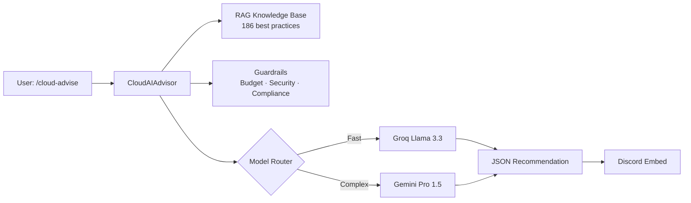
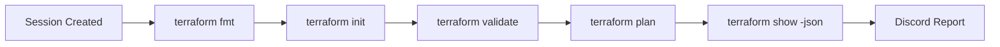

# ☁️ Cloud Engine

The Cloud Engine is Vespera's infrastructure operations brain. It combines AI-generated recommendations, a RAG knowledge base of cloud best practices, compliance guardrails, and direct Terraform CLI validation into a single Discord workflow.

---

## Overview



---

## AI Model Routing

| Task | Model | Reason |
|------|-------|--------|
| General recommendations | **Groq Llama 3.3** | Ultra-fast (~1–2s), sufficient reasoning |
| Complex doc analysis | **Gemini Pro 1.5** | 1M+ token context window for log/state files |
| Balanced quality | **Groq Mixtral** | Trade-off between speed and depth |

---

## Key Features

### RAG Knowledge Base
- **186 best practices** ingested from Markdown across GCP, AWS, and Azure
- Hybrid search: keyword matching + metadata category filtering
- Categories: Security (48), Performance (47), Cost (46), Reliability (45)

### Guardrails System
Runs before any AI generation to block or warn on bad requests:

| Guardrail | Action |
|-----------|--------|
| GPU workload + Low budget | ⛔ BLOCKED |
| Healthcare data + Standard security | ⚠️ WARNING |
| HIPAA compliance missing audit logging | ⛔ BLOCKED |
| Overly complex architecture for beginners | ⚠️ WARNING |

### Chain-of-Thought Reasoning
For every recommendation, the model is forced through a structured internal `[Reasoning]` block before generating output:

1. Requirement Analysis
2. Constraints Identification
3. Best Practice Matching
4. Trade-off Analysis (Cost / Simplicity / Security / Scalability)

This prevents the "commit-then-justify" bias where an LLM picks an answer first and rationalizes it second.

### Terraform Validation Pipeline



---

## Discord Commands

### `/cloud-advise`
Get AI-powered cloud infrastructure recommendations.

```
Parameters:
  use_case        (required) What are you building?
  provider        GCP | AWS | Azure | Any (compare all)
  budget          Low (<$100/mo) | Medium | High (>$1000/mo)
  security_level  Standard | Enhanced | Compliance (HIPAA/GDPR/PCI)
  ai_model        Groq Llama 3.3 | Groq Mixtral | Gemini Pro | Gemini Flash
```

### `/cloud-validate`
Runs the full Terraform validation pipeline against a session's generated configuration.

### `/cloud-deploy`
Generates Terraform code from an advisory session and creates a deployment session ID.

---

## Technical Highlight — Lazy Glossary Injection

!!! tip "~90% Token Reduction"
    Rather than injecting the entire Cloud or D&D glossary into every prompt, the system scans the user's input for known keywords first. Only terms that **appear in the input** are injected into the prompt.

    - Input: `"I need a Kubernetes cluster for my microservices"`
    - Injected: only the `Kubernetes` and `microservices` glossary entries
    - Result: token consumption reduced ~90%, with higher accuracy (no irrelevant noise in context)

---

## Performance Metrics

| Model | Avg Response | Notes |
|-------|-------------|-------|
| Groq Llama 3.3 | 1–2s | Recommended default |
| Groq Mixtral | 2–3s | Higher quality |
| Gemini Pro | 3–5s | Large context tasks |
| Gemini Flash | 1–3s | Fast Google alternative |

| Operation | Time |
|-----------|------|
| RAG hybrid search | < 50ms |
| Terraform fmt | < 1s |
| Terraform init (cached) | 1–3s |
| Terraform plan | 3–10s |
