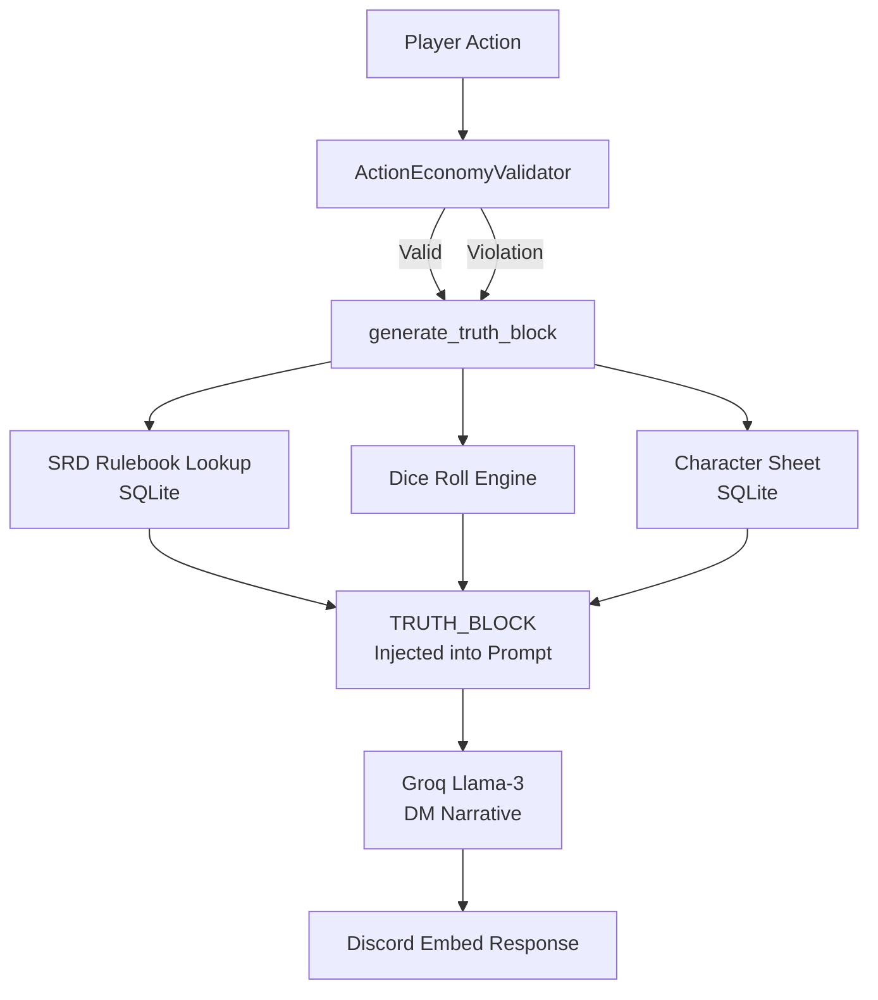
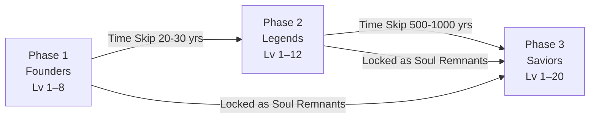

# 🐉 D&D System

Vespera's D&D module implements a complete D&D 5e/2024 rules engine for Discord — acting as an AI Dungeon Master, rules referee, and campaign record-keeper simultaneously.

---

## System Architecture



---

## Key Features

### Truth Block Protocol

!!! info "Anti-Hallucination Architecture"
    The D&D system uses a **RAG-Lite** approach called the Truth Block. Before any AI generation:

    1. **Retrieve** raw data (spell stats, monster HP, 5e rules) from the local SRD SQLite database
    2. **Inject** these values verbatim into a `[TRUTH_BLOCK]` section of the system prompt
    3. **Constrain** the model — it is strictly instructed to *format and narrate* the injected data, never to invent values

    **Result:** Vespera will not invent a D&D spell that doesn't exist, nor will she miscalculate hit points.

### Action Economy Validator

Enforces D&D 5e's action economy rules before any AI generation occurs:

| Resource | Limit per Turn |
|----------|---------------|
| Actions | 1 |
| Bonus Actions | 1 |
| Reactions | 1 |
| Movement | Up to speed (free) |

```python
# Example: Player attempts 2 actions
Player: "I attack the goblin and then cast Fireball"

# Validator detects:
#   action_count = 2  →  INVALID (limit 1)

# Truth Block injection:
[ACTION ECONOMY VIOLATION]
WARNING: Player attempted 2 actions but only has 1 per turn.
ENFORCEMENT RULE: Narrate only the FIRST action. Explain the limit naturally.
```

The AI then narrates the first action succeeding and explains the limitation in character — no robotic "Error: action limit exceeded" messages.

### Generational Void Cycle

A 3-phase campaign engine where characters age, die, and pass legacies to descendants:



- **Chronos Engine**: Randomized generational time skips with legacy buff calculation
- **Soul Remnants**: Phase 1/2 characters become mini-boss encounters in Phase 3
- **Automatic Tone Shifting**: Architect Mode dynamically shifts narrative tone (Gritty → Dramatic → Melancholy) based on scene context keywords
- **Chronicles**: Persistent campaign victory record across all three phases

### Rulebook Ingestor

Ingests the D&D 5e SRD 2024 into SQLite for local RAG retrieval:

- Structured parsing of spells, monsters, classes, and items
- Stored in `bot_database.db` for sub-millisecond lookup
- Keyword-based lazy injection — only relevant entries are pulled per prompt

---

## Discord Commands

| Command | Description |
|---------|-------------|
| `/start_session` | Initialize a D&D session for the server |
| `/join` | Register a character for the session |
| `/play` | Submit a player action to the DM |
| `/roll` | Roll dice with modifiers |
| `/time_skip` | Advance the campaign timeline (DM only) |
| `/mode_select` | Toggle Architect / Scribe mode (DM only) |
| `/chronicles` | View the campaign victory record |
| `/end_session` | Close the active session |

---

## Technical Highlight — Groq LPU for Combat Speed

!!! tip "Speed is King in Combat"
    D&D combat rounds must resolve in under 500ms to keep the game flowing. Unlike Cloud operations (where thinking time is acceptable), a 3-second "Goblin attacks with +4" kills immersion.

    Groq's LPU (Language Processing Unit) delivers near-instantaneous inference, hitting **~500 tokens/second** — making it the only viable choice for the real-time demands of tabletop combat.
